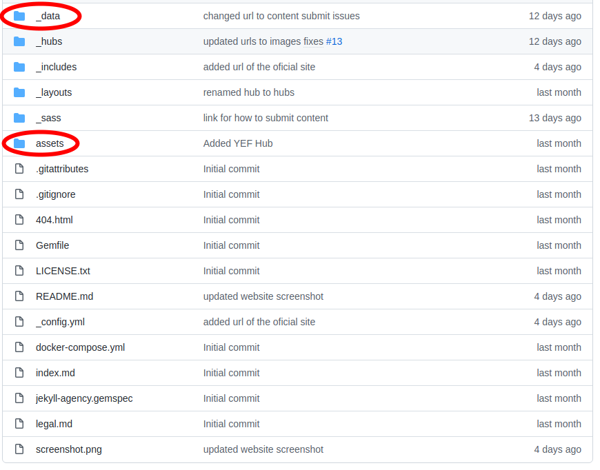
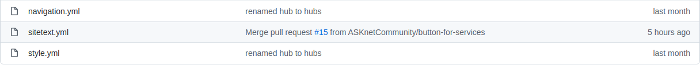

# #ASKnet Community Website

## Preview - click for live demo

[][demo-page]

## About

This is the [official website][demo-page] of the #ASKnet community. Here you can find all information and projects of #ASKnet. ASK stands for Access Skills & Knowledge. The net for the network. 

The #ASKnet community aims to build a sustainable network of trainers and empowered individuals, to address specific challenges their communities are facing and transform cultural patterns that fuel conflict and inequality.

## Participate

The website is based on the technology: Jekyll and is fully hosted on Github.

Jekyll compiles all markdown, HTML, CSS, Javascript files and more into a static website that can be run anywhere without any special requirements (database, PHP, Ruby or other). A simple web server is quite sufficient, or just Github with its offer: Github Pages ([more info about Github Pages](https://pages.github.com/))

The official website is generated here from this repository. I.e. if content/files are changed here, they are automatically published on the website. The content is written in Markdown .md ([more info about Markdown](https://www.markdownguide.org/)) or YAML .yml ([more info about YAML](https://en.wikipedia.org/wiki/YAML)).

### Most important directories and files

To change content (text or images) on the website, only the following directories are important at first:



- **_data:** there are .yml files, where in YAML format ([more info about YAML](https://en.wikipedia.org/wiki/YAML)) all text content, design styles and navigation are contained
- **_includes:** this directory contains all images, PDF, styles or script files

#### _data Folder

The website may contain multilingual content. All languages are in one file. E.g. in navigation.yml you can create multilingual navigation and in sitetext.yml multilingual content. The sections for each language always start with the name of the language and end with some parameters. Example:

```
# English (default)
# -----------------
en: &DEFAULT_EN

   [...]

en-US:
  <<: *DEFAULT_EN
en-CA:
  <<: *DEFAULT_EN
en-GB:
  <<: *DEFAULT_EN
en-AU:
  <<: *DEFAULT_EN
```



- **[navgation.yml](_data/navigation.yml):** 
- **[sitetext.yml](_data/sitetext.yml):** 

#### assets Folder


In the assets directory, only the `img` folder is important for the content. All images are stored there.

**Important:** Please use images only in the appropriate web format, i.e. not too large resolutions (max. 1920x1280 Px) and the appropriate image format. PNG is flexible, because transparent backgrounds also work, but JPG are better for photos, because they are much smaller.

The images can then be embedded in the corresponding Markdown file.

Example:

```

```

Or in a YAML file simply specify the path.

Example:

```
image: assets/img/projects/askotec-website.png
```

## Contributing

This project is intended to be a welcoming space for collaboration. If you have an idea, suggestion, feature request, etc., feel free to [open an issue](https://github.com/ASKnetCommunity/ASKnet.Community/issues) or [pull request](https://github.com/ASKnetCommunity/ASKnet.Community/pulls).

For bug reports, follow the provided template.

## Development

Requirements:

- git ([how to install git](https://git-scm.com/book/en/v2/Getting-Started-Installing-Git))
- docker ([how to install docker](https://docs.docker.com/get-docker/))
- docker-compose ([how to install docker-compose](https://docs.docker.com/compose/install/))

To set up your environment to develop this website, clone this repo or your fork.

```sh
$ git clone https://github.com/ASKnetCommunity/ASKnet.Community.git
$ cd ASKnet.Community
```

Then run:

```sh
$ docker-compose up -d
```

To check the logs, run this. (Using the `--follow` flag for tail the output.)

```sh
$ docker-compose logs --follow
```

Then open your browser at:

- http://localhost:4000

Add pages, documents, data, etc. like normal to test the website's contents. As you make modifications, your site will regenerate and you should see the changes in the browser after a refresh.

To stop the website:

```sh
$ docker-compose down
```

## Partners and Funder

| r0g Agency | ASKnet  | BMZ |
| :--------: | :----: | :-------: |
|[](https://openculture.agency/)|[](https://github.com/ASKnet-Open-Training)|  [](https://www.bmz.de/en/) |
| [Official Website](https://openculture.agency/) | [Official Website](https://github.com/ASKnet-Open-Training) | [Official Website](https://www.bmz.de/en/) |


## License

All content is licensed under CC-BY-SA 4.0 

Theme used: [Agency Theme (Jekyll version)](https://github.com/raviriley/agency-jekyll-theme). The theme is available as open source under the terms of the [MIT License](https://opensource.org/licenses/MIT).

Technologies used: 
- [Bootstrap](https://getbootstrap.com/) which is available as open source under the terms of the [MIT License](https://opensource.org/licenses/MIT).
- FontAwesome - [License here](https://fontawesome.com/license/free)  (Icons: CC BY 4.0, Fonts: SIL OFL 1.1, Code: MIT License)
- [jqBootstrapValidation](https://reactiveraven.github.io/jqBootstrapValidation/) which is available as open source under the terms of the [MIT License](https://opensource.org/licenses/MIT).

Fonts used: 
- montserrat-v24-latin-ext_latin-regular.ttf: Copyright 2011 The Montserrat Project Authors (https://github.com/JulietaUla/Montserrat)
- montserrat-v24-latin-ext_latin-700.ttf: Copyright 2011 The Montserrat Project Authors (https://github.com/JulietaUla/Montserrat)
- noto-serif-v21-latin-ext_latin-regular.ttf: Copyright 2012 Google Inc. All Rights Reserved.
- noto-serif-v21-latin-ext_latin-italic.ttf: Copyright 2012 Google Inc. All Rights Reserved.
- noto-serif-v21-latin-ext_latin-700italic.ttf: Copyright 2012 Google Inc. All Rights Reserved.
- noto-serif-v21-latin-ext_latin-700.ttf: Copyright 2012 Google Inc. All Rights Reserved.

[demo-page]: https://asknetcommunity.github.io/ASKnet.Community/
