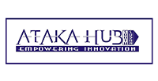

{:.list-inline .hub-summary}
| Location: | Bor, South Sudan |
| --------- | ------------------ |
| Mission:  | To build and empower our communities on technology, activism, and sustainable programs that can bring development and change. |
| Overview of Activities & Trainings: |  Peacebuilding, #defyhatenow, Gender Based Violence Awareness, Entrepreneurship, Open Tech Skills using #ASKotec, Entrepreneurial Skills for women and youth, Poverty Mitigation, #eatBCH food donations to orphans, widows and the elder |

{:.logo}

ATAKA-HUB fosters peacebuilding using social media skills training, comedy theatre and gender equality awareness, and youth self-employment through open tech and repairing skills. ATAKA uses cryptocurrency #eatBCH to provide food to orphans in Bor.

### Upcoming planning

We would work more on protective measures against COVID-19, this includes ways you can run your business at home, fighting misinformation, production of more PSA (public service announcement), more of our information will be in recording, social distancing.This awareness will help our community protect itself from the pandemic, not forgetting practicing more online and phone call meetings and training (more virtual activities). When COVID-19 is done we will be back to workshop and high school training with #ASKotec and setting up of ATAKA Hub start-up.

### Challenges

physical space, moving from rental to own space (build?)
presence of ATAKAHUB in other Jonglei state counties for applying programmes such as eatBCH_SS (better networking, knowledge sharing)
Foundation

For the founder of ATAKA-Hub (Access Tech Advocacy Knowledge for All), Bior Ajang, it all started with a phone call. His good friend and co-founder of Platform Africa, Jaiksana Soro, invited him to take part in the #peacehackcamp in Juba back in 2015. “After the #peacehackcamp, I went back to Bor and once I was there, I thought: So now I have the skills, am I going just to stay like that? What if people could need my help? That is how I came up with the idea of creating a community based organization that could actually help others just like I was helped. That is how I came with the idea of ATAKA-Hub.”
Bior is very clear about his mission in life: “I am going to make sure I will help the community, just like I was helped by my aunty. And that is why ATAKA Hub is going to focus mostly on the youth who dropped out of school and those who are interested to do something for the community. There are people down there who can do something but they don’t know it. Someone has to tell them. Look at me, if my aunt wouldn’t have taken me out of all this stuff, I wouldn’t know that I can make it this far and do something for the community.”

Michael Garang, member and trainer at ATAKA Hub believes that “when there are problems in the community, many people are expecting that the solution will come from big people, mainly the government. Then we realized that blaming will bring no answers, so we are better part of the solution. We came up with founding ATAKA Hub to take part in the solution. Changing community live is a collective and not a one man responsibility.

### Skills

ATAKA Hub primarily focuses on events and hands-on workshops for children and youth in Bor town in the areas of open tech innovation (#ASKotec & entrepreneurial empowerment), peacebuilding (comedy theatre, media skills training and gender based violence awareness) and poverty mitigation (food donations to orphans, widows and the elder using cryptocurrency #eatBCH).

### SUPPORTERS/COMMUNITY

UNMISS HUMAN RIGHTS DIVISION
assistance in facilitations of trainings on human rights and peace building, in the communities, secondary and primary schools (including venue, transport, catering of participants), as well as in management development of ATAKA Hub.
CHURCHES: Assistance in community outreach and providing venues for trainings
SCHOOLS: Local primary and secondary schools that ATAKA Hub are already working with, provide space and access to pupils and students
INTERNATIONAL
GIG? AFRILABS? AFRICAOSH?

### PROGRAMS & COMMUNITY IMPACT

Bior: “There are people in the community who are capable of doing something but they just need the support of someone who has passes through that struggle. Because now we understand what life is about, you understand how you can tackle life. It is not that because you have lost your parents, like I did, that this is the end of me, the end of life, or because who has maltreated you. That is not the end, you can choose another way. We are going to focus so much on bringing the youth together and giving them training on skills, so that someone is able to raise himself, instead of causing problems in the community. If you look at the community, most of people doing crime are youth, because they don’t have jobs. They think no one will employ them, but they can actually create their own jobs and employ other youth around them. That is our mission, to make sure the people the community think are wrong, are meant to be the right people.” Michael Garang.